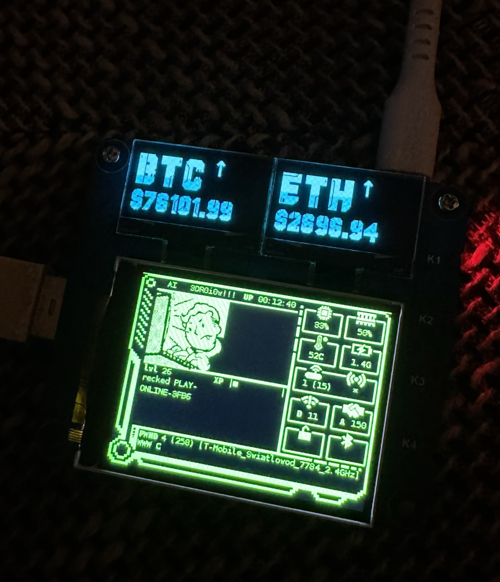
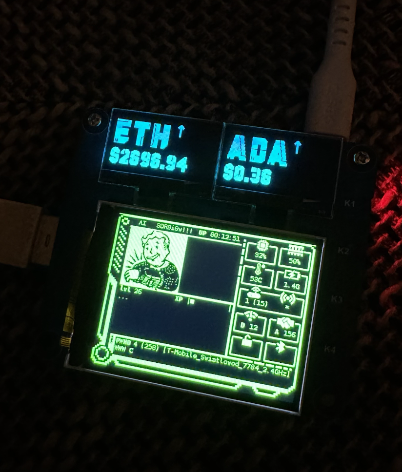

# Fancygotchi-plugins
Set of plugins for Fancygotchi 2.0

---------------------------------------------

# Gamepad Control Plugin for Pwnagotchi - [pad-control.py](https://github.com/LOCOSP/Fancygotchi-plugins/blob/main/pad-control.py)

A plugin to control the FancyGotchi 2.0 menu in Pwnagotchi using a USB gamepad, allowing seamless navigation with intuitive gamepad controls. The plugin supports basic directional and button-based commands to enhance user interaction with the FancyGotchi menu interface.

## Demo


## Features

- Control FancyGotchi 2.0 menu via USB gamepad
- Configurable button mappings for custom commands
- Log information for troubleshooting and command tracking

## Requirements

- Pwnagotchi device with FancyGotchi 2.0 installed
- A compatible USB gamepad
- Python dependencies (evdev library)

## Installation

1. **Install Dependencies**  
  Install the required Python packages `evdev`:
   ```bash
    sudo apt update && sudo apt install python3-evdev -y
   ```
    Next go to custom-plugins folder:
    `cd /usr/local/share/pwnagotchi/custom-plugins/`
    and download RAW plugin script:
    `sudo wget https://raw.githubusercontent.com/LOCOSP/Fancygotchi-plugins/refs/heads/main/pad-control.py`

2. **Enable the Plugin**  
   Open your `config.toml` file and add the following entries:
   ```toml
   # Enable the pad-control plugin
   main.plugins.pad-control.enabled = true
   main.plugins.pad-control.device_path = "/dev/input/event0"  # Path to the gamepad device

   # Assign commands to buttons
   main.plugins.pad-control.button_command_key_a = "fancytools -m select"
   main.plugins.pad-control.button_command_key_b = "fancytools -m toggle"
   main.plugins.pad-control.button_command_key_up = "fancytools -m up"
   main.plugins.pad-control.button_command_key_down = "fancytools -m down"
   main.plugins.pad-control.button_command_key_left = "fancytools -m left"
   main.plugins.pad-control.button_command_key_right = "fancytools -m right"
   ```

3. **Set Up Logging**  
   The plugin includes logging for all button presses. To access logs, check your Pwnagotchi's log directory after setup.

4. **Restart Pwnagotchi**  
   Restart your Pwnagotchi device to apply the new configuration and enable the plugin.

## Usage

Once installed and configured, use the gamepad to navigate the FancyGotchi 2.0 menu using the designated button mappings. The logs will provide feedback on button presses and the associated commands to aid in debugging or customizing inputs.

## Troubleshooting

- Ensure the `device_path` in `config.toml` points to the correct gamepad event.
- Check logs for any unassigned button events or command issues.
- Test your Game Pad usind `evtest /dev/input/event0` that value `/dev/input/event0` can be different for you.

## License

This project is licensed under the GPL-3.0 License.

----------------------------------------------------


# Watch how rich or how poor you are with OLED-CryptoStats [OLED-CryptoStats.py](https://github.com/LOCOSP/Fancygotchi-plugins/blob/main/OLED-plugins/OLED-CryptoStats.py)

## Screens




1. **Install**  
   Go to custom-plugins folder:
    `cd /usr/local/share/pwnagotchi/custom-plugins/`
    and download RAW plugin script:
    `sudo wget https://raw.githubusercontent.com/LOCOSP/Fancygotchi-plugins/refs/heads/main/OLED-plugins/OLED-CryptoStats.py`


2. **Enable the Plugin**  
   Open your `config.toml` file and add the following entries:
```toml
main.plugins.OLED-CryptoStats.enabled = true
main.plugins.OLED-CryptoStats.pairs = [
 "BTCUSDT",
 "ETHUSDT",
]
main.plugins.OLED-CryptoStats.update_interval = 300
main.plugins.OLED-CryptoStats.display_interval = 15
```
you can add any number of pairs supported by Binance, in this version currencies paired with USDT are only supported.

## Troubleshooting

- Ensure the Internet connect is established.
- Check if Binance API is available.
- Check if pair is listed in Binance.

## License

This project is licensed under the GPL-3.0 License.

----------------------------------------------------


# Funny robot eyes looking around and infom you about new handshakes [OLED-eyes.py](https://github.com/LOCOSP/Fancygotchi-plugins/blob/main/OLED-plugins/OLED-eyes.py)

## Demo


1. **Install**  
   Go to custom-plugins folder:
    `cd /usr/local/share/pwnagotchi/custom-plugins/`
    and download RAW plugin script:
    `sudo wget https://raw.githubusercontent.com/LOCOSP/Fancygotchi-plugins/refs/heads/main/OLED-plugins/OLED-eyes.py`


2. **Enable the Plugin**  
   Open your `config.toml` file and add the following entries:

```toml
main.plugins.OLED-eyes.enabled = true
```


## Troubleshooting

- just check `pwnlog` if something is wrong

## License

This project is licensed under the GPL-3.0 License.
